# Rencana Arsitektur & Spesifikasi Seluruh Flow Sistem (Dijak Express / Scan-Resi)

Dokumen ini memuat spesifikasi terstruktur untuk **13 Flow Proses Fungsional** yang ada di dalam platform Dijak Express (Wahana Scan Resi Magang), terbagi ke dalam **4 Kategori Utama**, lengkap dengan diagram alir Mermaid mandiri dan alur integrasi *End-to-End*.

---

## 1. Integrasi Makro: End-to-End Core Lifecycle

Diagram berikut menggambarkan interaksi lintas peran antara **Customer**, **Petugas Scan**, dan **Admin** beserta siklus hidup paket logistik:

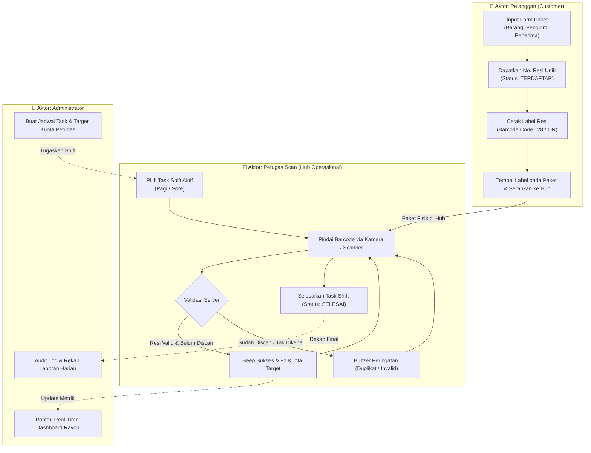

---

## 2. Kategori 1: Flow Autentikasi & Keamanan (Auth)

### Flow 1.1: Login Kredensial + OTP 2FA (Email)
* **Tujuan**: Memastikan keamanan akun dengan verifikasi dua langkah (Kata Sandi + Token OTP 6-Digit via Email).

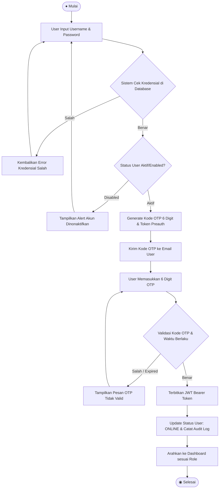

---

### Flow 1.2: Resend OTP (Kirim Ulang Kode OTP)
* **Tujuan**: Memberikan kesempatan kepada user meminta kode baru jika OTP sebelumnya tidak kunjung sampai atau sudah kadaluarsa.

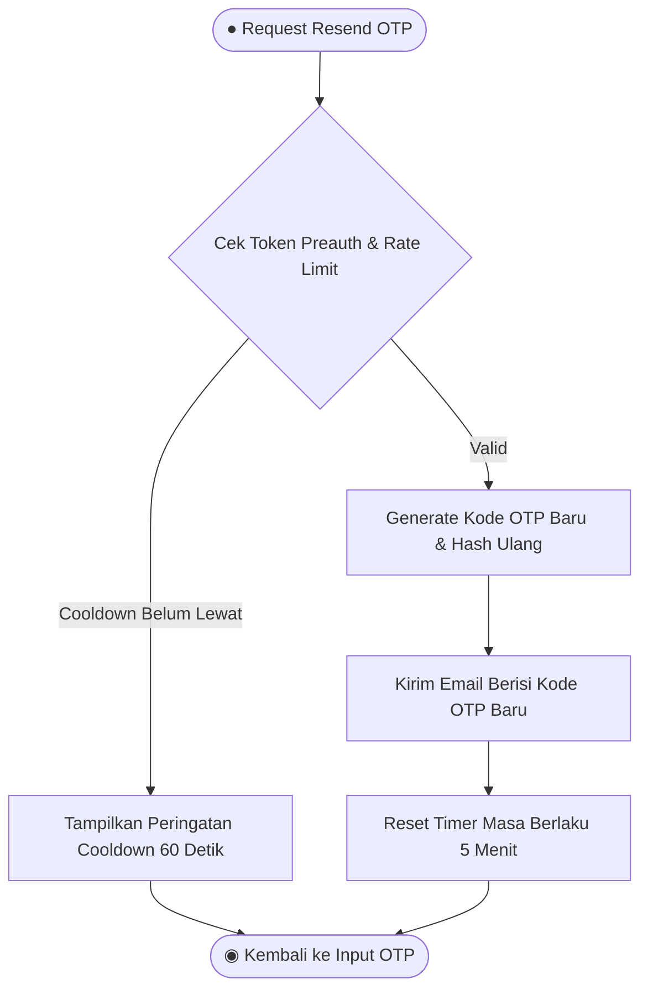

---

### Flow 1.3: Lupa & Reset Password via OTP
* **Tujuan**: Memulihkan akun pengguna yang lupa kata sandi dengan verifikasi kepemilikan email.

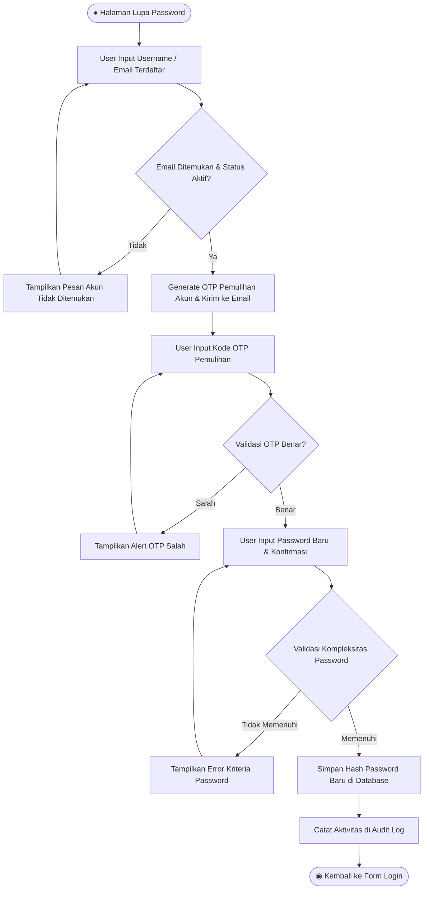

---

### Flow 1.4: Quick Login Simulator (Demo & Testing)
* **Tujuan**: Mengizinkan penguji beralih peran (`ADMIN`, `PETUGAS_SCAN`, `CUSTOMER`) secara instan untuk pengujian fungsional tanpa login berulang.

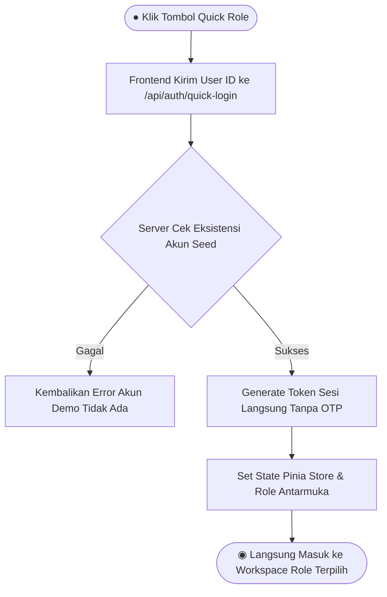

---

### Flow 1.5: Logout & Audit Status
* **Tujuan**: Mengakhiri sesi pengguna secara aman dan memperbarui status kehadiran sistem.

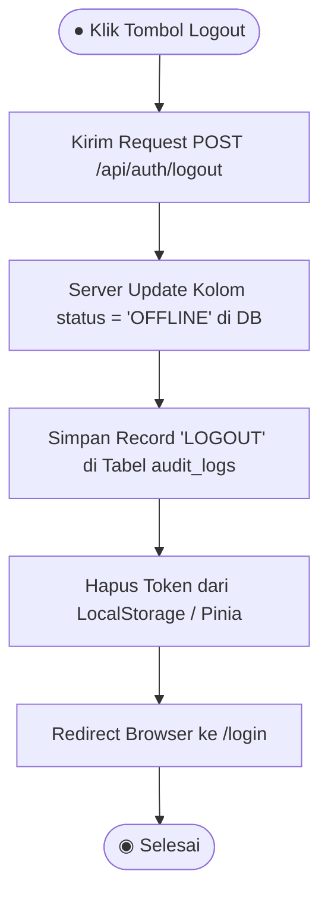

---

## 3. Kategori 2: Flow Pelanggan / Customer Portal

### Flow 2.1: Pembuatan Paket & Auto-Generate Nomor Resi
* **Tujuan**: Pelanggan mendaftarkan pengiriman barang baru secara mandiri.

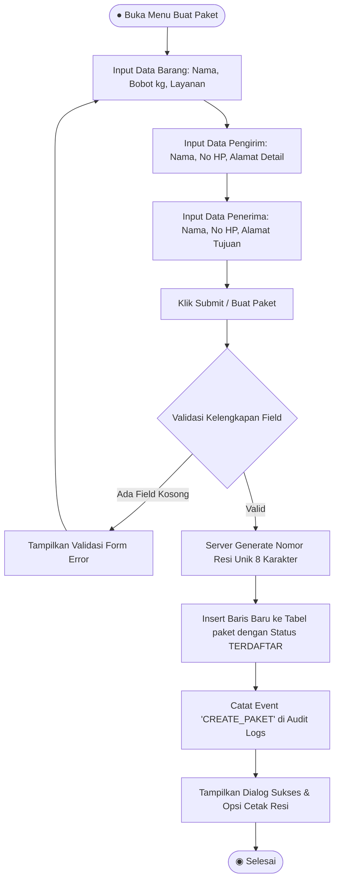

---

### Flow 2.2: Cetak Label Pengiriman Ber-Barcode (Code 128 / QR)
* **Tujuan**: Mencetak label pengiriman standar fisik dengan barcode yang dapat dibaca scanner.

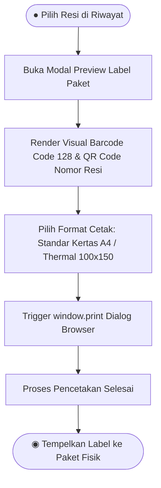

---

### Flow 2.3: Riwayat & Status Pelacakan Paket
* **Tujuan**: Pelanggan memantau status seluruh paket yang pernah didaftarkan.

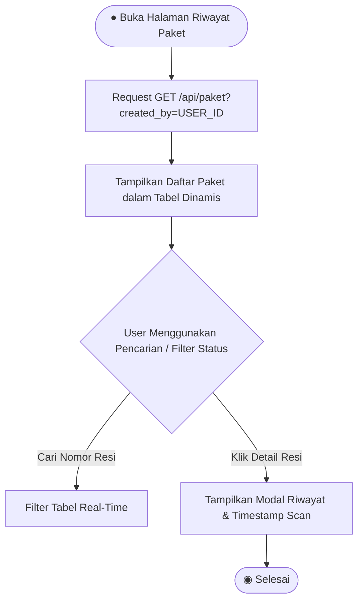

---

## 4. Kategori 3: Flow Petugas Operasional (Scan Engine)

### Flow 3.1: Inisialisasi & Pemilihan Tugas Shift
* **Tujuan**: Petugas mengikat sesi kerja harian dengan kuota target sebelum memindai.

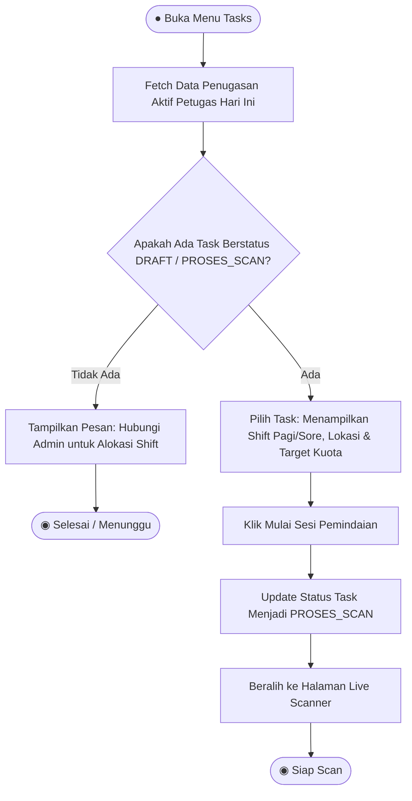

---

### Flow 3.2: Live Barcode Scanning Engine (Validasi Server & Feedback Audio)
* **Tujuan**: Inti operasional pemindaian cepat, validasi anti-duplikasi, dan pencatatan kuota.

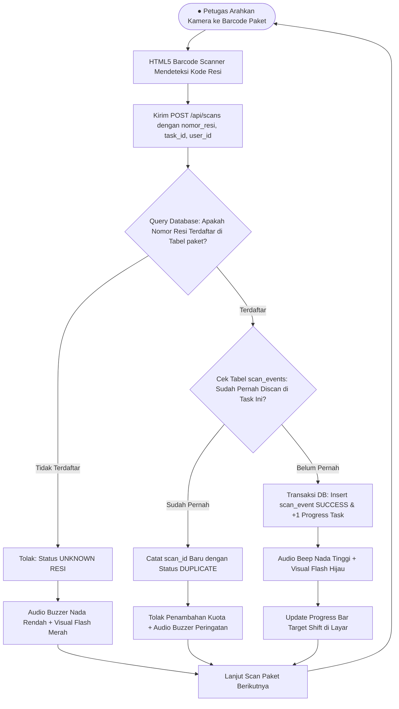

---

### Flow 3.3: Penyelesaian Shift (Complete Task)
* **Tujuan**: Mengakhiri shift dan mengunci hasil pemindaian agar tidak terjadi modifikasi kuota lanjutan.

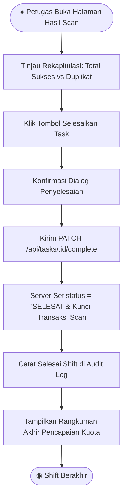

---

## 5. Kategori 4: Flow Administrator (Supervisi & Master Data)

### Flow 4.1: Rayon Real-Time Monitoring Dashboard
* **Tujuan**: Memantau kesehatan operasional rayon secara makro dan performa petugas secara langsung.

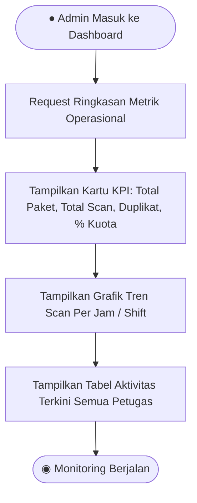

---

### Flow 4.2: Manajemen Pengguna (User Management RBAC)
* **Tujuan**: Mengatur hak akses, membuat pengguna baru, dan mengaktifkan/menonaktifkan akun.

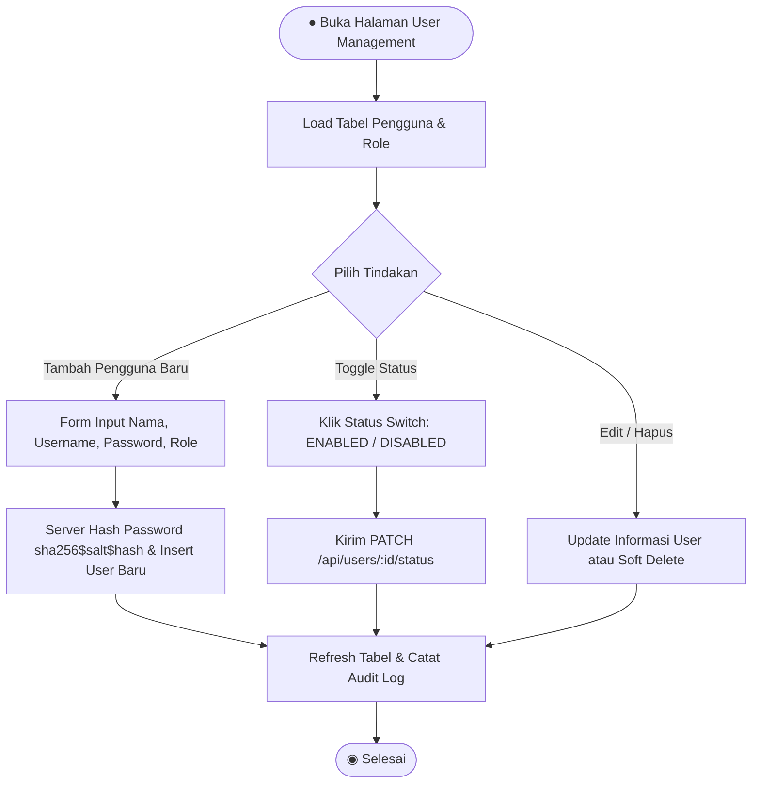

---

### Flow 4.3: Alokasi & Manajemen Task Shift Petugas
* **Tujuan**: Membagi beban target kuota scan harian kepada petugas operasional.

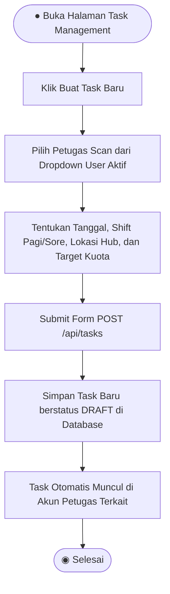

---

### Flow 4.4: Rekapitulasi Laporan & Ekspor Analitik
* **Tujuan**: Mengkaji data historis pengiriman dan kinerja petugas dalam periode tertentu.

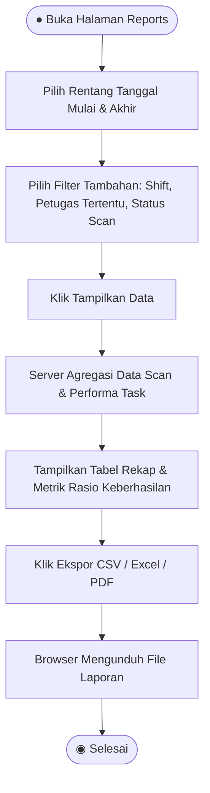

---

### Flow 4.5: Audit Trail & Jejak Aktivitas (Audit Logs)
* **Tujuan**: Merekam dan menginspeksi segala aktivitas penting di sistem untuk kepatuhan dan pelacakan insiden.

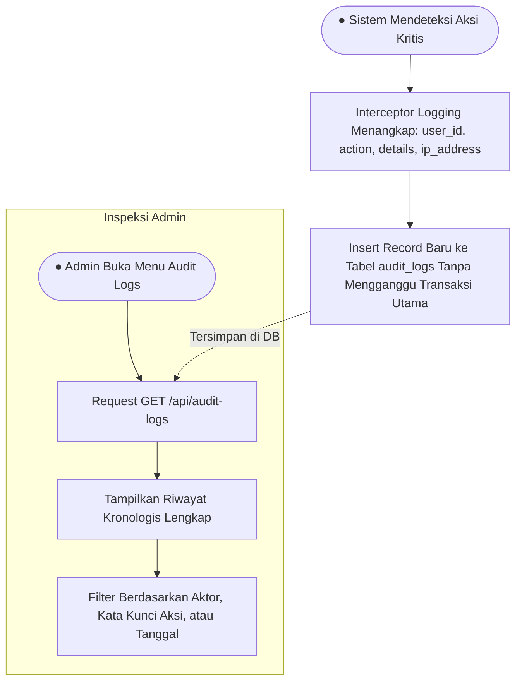

---

## 6. Rangkuman Pemetaan Modul & Kode Sumber

| No | Nama Flow | Komponen Frontend | Endpoint Backend | Tabel DB Terkait |
| :--- | :--- | :--- | :--- | :--- |
| **1.1** | Login Kredensial + OTP | `LoginPage.vue` | `POST /api/auth/login` `POST /api/auth/verify-otp` | `users`, `audit_logs` |
| **1.2** | Resend OTP | `LoginPage.vue` | `POST /api/auth/resend-otp` | `users` |
| **1.3** | Reset Password OTP | `LoginPage.vue` | `POST /api/auth/forgot-password` `POST /api/auth/reset-password` | `users`, `audit_logs` |
| **1.4** | Quick Login Demo | `LoginPage.vue` | `POST /api/auth/quick-login` | `users` |
| **1.5** | Logout Presensi | `MainLayout.vue` | `POST /api/auth/logout` | `users`, `audit_logs` |
| **2.1** | Buat Paket & Resi | `CustomerBuatPaketPage.vue` | `POST /api/paket/resi` | `paket`, `audit_logs` |
| **2.2** | Cetak Label Resi | `CustomerPaketPage.vue` | - | `paket` |
| **2.3** | Riwayat Paket Customer | `CustomerPaketPage.vue` | `GET /api/paket` | `paket` |
| **3.1** | Inisialisasi Shift | `PetugasTasksPage.vue` | `GET /api/tasks` | `tasks` |
| **3.2** | Live Scan Engine | `PetugasScanPage.vue` | `POST /api/scans` | `scan_events`, `tasks`, `paket` |
| **3.3** | Selesai Shift | `PetugasHasilPage.vue` | `PATCH /api/tasks/:id/complete` | `tasks`, `audit_logs` |
| **4.1** | Monitoring Rayon | `AdminDashboard.vue` | `GET /api/scans`, `GET /api/tasks` | `scan_events`, `tasks` |
| **4.2** | User Management | `AdminUserManagementPage.vue` | `GET/POST/PUT/DELETE /api/users` | `users`, `audit_logs` |
| **4.3** | Alokasi Task Shift | `AdminTasksPage.vue` | `POST /api/tasks` | `tasks`, `users` |
| **4.4** | Rekap Laporan | `AdminReportsPage.vue` | `GET /api/scans/stats/:user_id` | `scan_events`, `tasks` |
| **4.5** | Audit Logs | `AdminAuditLogsPage.vue` | `GET /api/audit-logs` | `audit_logs` |
