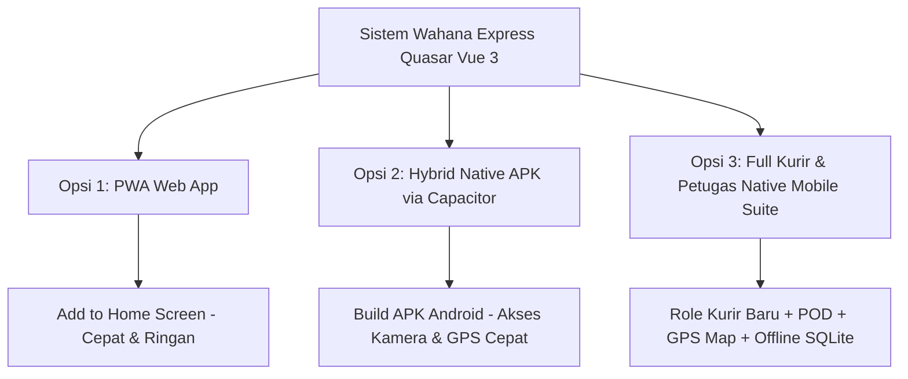

# 📱 Mobile App Expansion Plan — Wahana Express (Petugas & Kurir)

Dokumen ini memuat analisis arsitektur, pilihan opsi implementasi, perbandingan teknis, dan roadmap langkah demi langkah untuk menjadikan sistem **Wahana Express** sebagai aplikasi mobile bagi **Petugas Scan** (Sortir/Gudang) dan **Kurir Lapangan**.

---

## 1. Analisis Kebutuhan Pengguna

| Pengguna | Kebutuhan Utama di Lapangan | Fitur Hardware yang Dibutuhkan |
| :--- | :--- | :--- |
| **Petugas Scan (Gudang/Sortir)** | • Scan cepat ratusan barcode resi per shift.<br>• Input manual nomor resi jika barcode rusak.<br>• Monitoring kuota scan harian.<br>• Cetak label barcode ulang. | • Kamera Scanner Kecepatan Tinggi / USB-OTG Barcode Gun.<br>• Printer Label Thermal. |
| **Kurir (Delivery & Pick-up)** | • Daftar antaran paket harian (*Delivery Manifest*).<br>• Update status: *On Delivery*, *Delivered*, *Failed*.<br>• Bukti Serah Terima (*Proof of Delivery* - Foto & TTD).<br>• Navigasi rute alamat penerima via Google Maps.<br>• Mode Offline jika di area minim sinyal. | • Kamera Foto Penerima & Scanner.<br>• GPS / Geolocation.<br>• Layar sentuh untuk Tanda Tangan Digital.<br>• Bluetooth Thermal Mini-Printer (opsional struk). |

---

## 2. Pilihan Opsi Implementasi



### 🔹 Opsi 1: PWA (Progressive Web App) — *Instan & Tanpa Install APK*
* **Deskripsi**: Mengoptimalkan konfigurasi PWA yang sudah ada di proyek Quasar (`src-pwa`, `workbox`).
* **Distribusi**: Petugas/kurir cukup buka web di browser HP lalu klik *"Install Aplikasi"* / *"Add to Home Screen"*.
* **Kelebihan**:
  * ✅ **0 Konfigurasi Android Studio / SDK**: Langsung jalan di semua tipe smartphone (Android & iOS).
  * ✅ **Auto-Update**: Begitu server web diperbarui, aplikasi di HP petugas langsung terupdate otomatis.
  * ✅ **Fitur Kamera & Scanner**: Sudah berfungsi dengan `html5-qrcode`.
* **Kekurangan**:
  * ❌ Akses Bluetooth thermal printer terbatas pada Web Bluetooth API.
  * ❌ Notifikasi push memerlukan izin browser aktif.

---

### 🔹 Opsi 2: Hybrid Native Mobile App via Capacitor — *File APK Standalone*
* **Deskripsi**: Mengintegrasikan **Capacitor 6 / 7** ke dalam Quasar untuk menghasilkan file installer **`.apk`** Android murni.
* **Distribusi**: File `.apk` dibagikan langsung ke grup petugas/kurir atau diupload ke internal server/Play Store.
* **Kelebihan**:
  * ✅ **Aplikasi Terpasang Permanen**: Icon aplikasi resmi di launcher HP dengan Splash Screen branding Dijak/Wahana Express.
  * ✅ **Scanner Kamera Lebih Cepat**: Menggunakan modul native ML Kit / CameraX (*0 latency focus*).
  * ✅ **Akses Hardware Penuh**: GPS background, Bluetooth Thermal Printer, Galeri/Kamera langsung.
* **Kekurangan**:
  * ⚠️ Memerlukan instalasi Android Studio & Android SDK di komputer developer untuk proses *compilation*.

---

### 🔹 Opsi 3: Full Courier & Staff Mobile Suite (Rekomendasi Terbaik)
* **Deskripsi**: Opsi 2 (Native Capacitor APK) ditambah **Penambahan Modul Khusus Role Kurir (`KURIR`)** pada backend dan frontend.
* **Fitur Tambahan Khusus**:
  1. **Role Baru `KURIR`**:
     * Portal khusus kurir: `/kurir/dashboard`, `/kurir/manifest`, `/kurir/pod`.
  2. **Proof of Delivery (POD)**:
     * Ambil foto penerima paket di rumah pelanggan.
     * Kanvas tanda tangan digital (*signature pad*).
  3. **Navigasi Satu Klik**:
     * Tombol *"Arahkan Peta"* yang otomatis membuka titik koordinat/alamat penerima di Google Maps / Waze.
  4. **Sinkronisasi Offline (Offline-First)**:
     * Kurir tetap bisa scan dan submit status di daerah *blank spot* (offline). Data otomatis disinkronkan ke server saat HP mendapat internet.

---

## 3. Matriks Perbandingan Opsi

| Kriteria | Opsi 1: PWA | Opsi 2: Capacitor APK | Opsi 3: Full Suite + Kurir POD |
| :--- | :---: | :---: | :---: |
| **Kecepatan Implementasi** | ⚡ Sangat Cepat (1-2 hari) | 🚀 Cepat (3-4 hari) | 🛠️ Komprehensif (1-2 minggu) |
| **Kemudahan Distribusi** | Kirim URL Web | Bagikan File `.apk` | Bagikan File `.apk` |
| **Kebutuhan Android Studio** | Tidak Perlu | Perlu | Perlu |
| **Kamera Scanner Barcode** | Cukup Cepat (Webcam API) | Sangat Cepat (Native MLKit) | Sangat Cepat (Native MLKit) |
| **Fitur Proof of Delivery (Foto+TTD)**| Dasar (HTML5 Canvas) | Lengkap (Native File System) | Lengkap + Cloud Upload |
| **Navigasi Alamat (Google Maps)** | Link Web Map | App-to-App Intent | App-to-App Intent |
| **Kesiapan untuk Kurir Lapangan** | ⭐⭐⭐ | ⭐⭐⭐⭐ | ⭐⭐⭐⭐⭐ |

---

## 4. Rencana Kerja (Implementation Plan)

### Tahap 1: Persiapan & Optimasi Mobile UI
1. [x] Menyesuaikan viewport mobile di `quasar.config.js` dan layout `MainLayout.vue` agar nyaman untuk *one-handed operation* (operasi satu tangan kurir).
2. [ ] Menambahkan Bottom Navigation Bar khusus tampilan mobile untuk memudahkan berpindah menu (Dashboard, Scan, Tugas, Profil).

### Tahap 2: Setup Capacitor Engine (Untuk Opsi 2 / 3)
1. [ ] Menjalankan inisialisasi Capacitor:
   ```bash
   npx quasar mode add capacitor
   ```
2. [ ] Mengonfigurasi `capacitor.config.json` (App ID: `com.wahana.scanexpress`, App Name: `Wahana Scanner & Kurir`).
3. [ ] Menambahkan plugin native:
   - `@capacitor/camera` (Ambil foto bukti paket)
   - `@capacitor/geolocation` (Tracking lokasi serah terima)
   - `@capacitor-community/barcode-scanner` atau kamera scan bawaan.

### Tahap 3: Pembuatan Modul Khusus Kurir (Khusus Opsi 3)
1. [ ] **Database & Backend**:
   - Menambahkan enum `'KURIR'` pada tabel `users`.
   - Menambahkan tabel `delivery_manifest` dan `proof_of_delivery` (foto bukti, koordinat GPS, tanda tangan).
   - Stored procedure baru: `sp_kurir_get_tasks`, `sp_kurir_submit_pod`.
2. [ ] **Frontend**:
   - Halaman `KurirDeliveryPage.vue` (Daftar paket yang harus diantar).
   - Halaman `KurirPodPage.vue` (Form serah terima + kamera + tanda tangan).
   - Integrasi link ke Google Maps berdasarkan teks alamat tujuan.

### Tahap 4: Build & Pengujian APK
1. [ ] Pengujian build APK Debug & Release:
   ```bash
   npx quasar build -m capacitor -T android
   ```
2. [ ] Uji coba install APK di smartphone Android fisik.
3. [ ] Uji coba scan barcode resi fisik dalam kondisi pencahayaan minim menggunakan lampu flash (*torch mode*).
